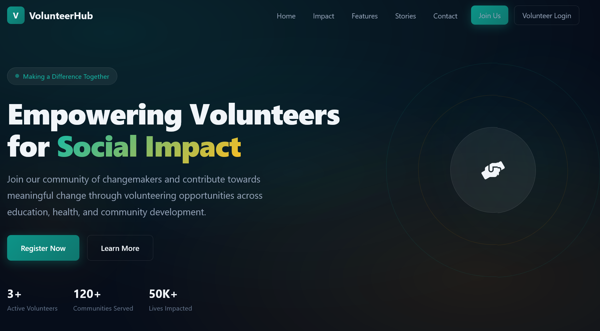
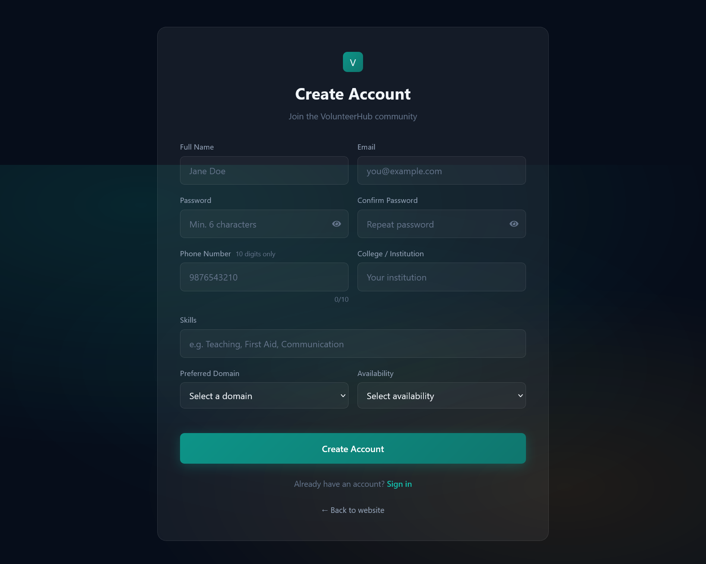
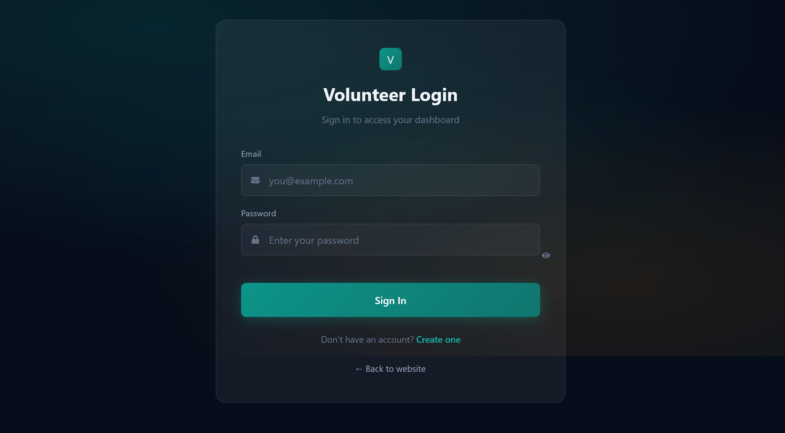
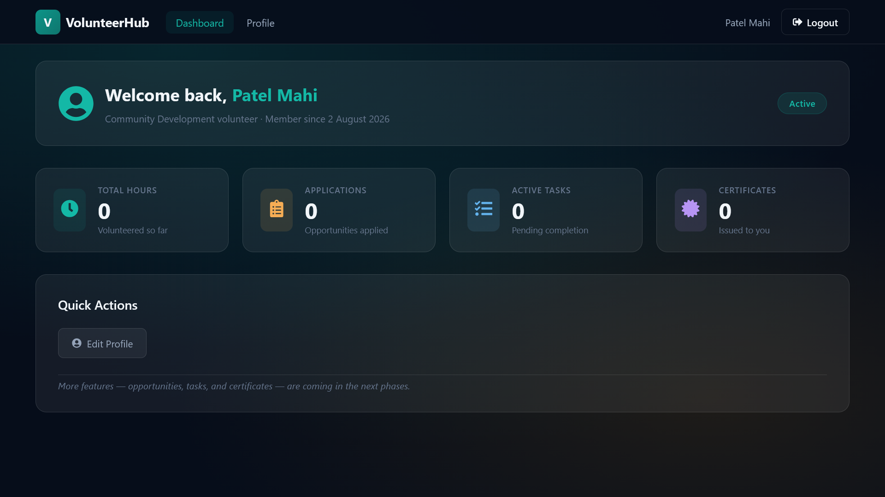
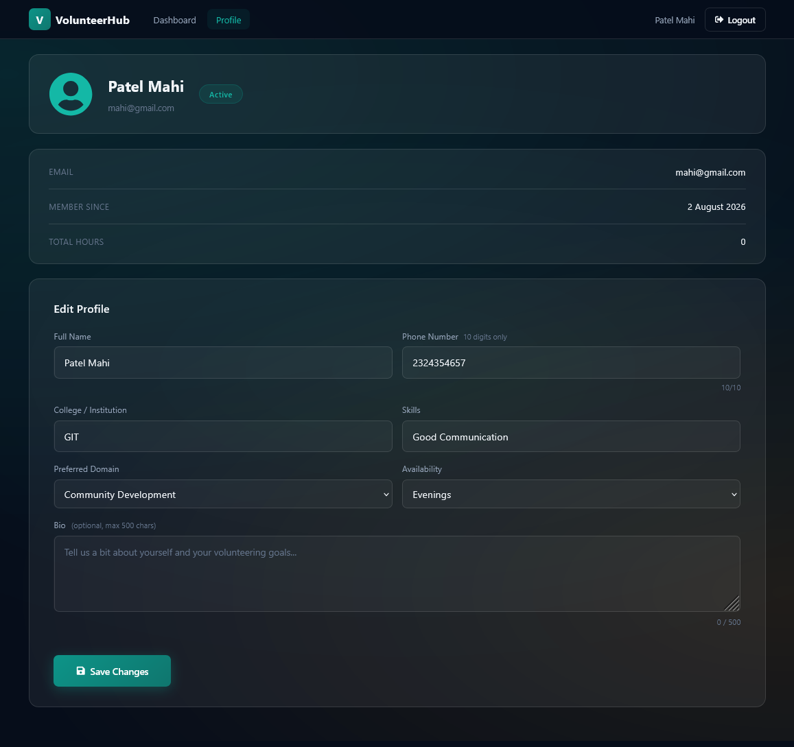
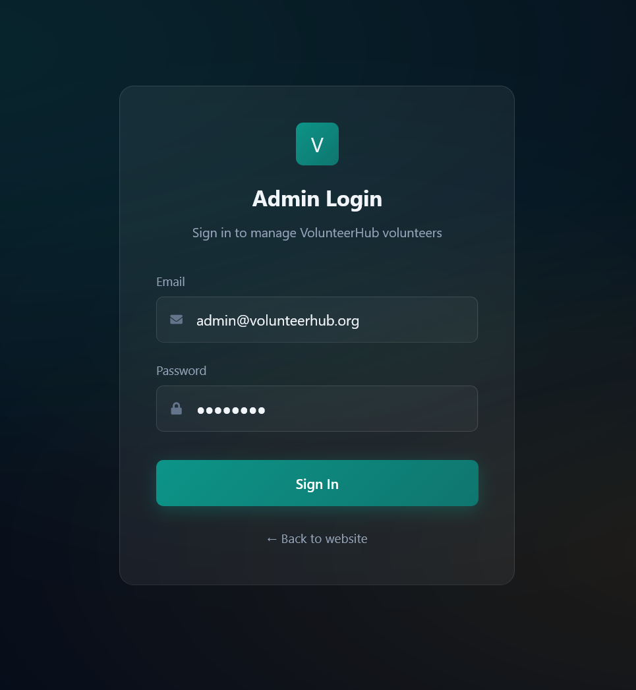
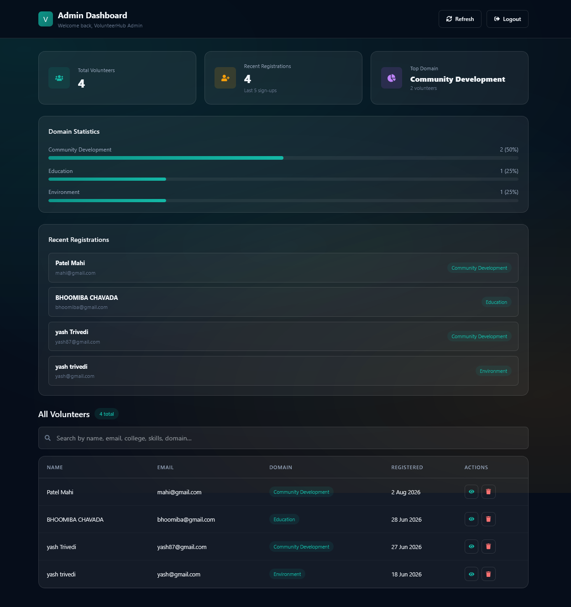

<div align="center">

# 🤝 VolunteerHub

### A Full-Stack Volunteer Management Platform

Connecting volunteers with opportunities to serve — built on the MERN stack with secure authentication and real-time platform analytics.

[](https://opensource.org/licenses/MIT)
[](https://react.dev/)
[](https://nodejs.org/)
[](https://expressjs.com/)
[](https://www.mongodb.com/atlas)
[](https://volunteer-management-system-bt8b.vercel.app/)
[](https://volunteer-management-system-1-byv4.onrender.com/)

[Live Demo](https://volunteer-management-system-bt8b.vercel.app/) · [Report Bug](https://github.com/Khushi288-creator/Volunteer-Management-System/issues) · [Request Feature](https://github.com/Khushi288-creator/Volunteer-Management-System/issues)

</div>

---

## 📋 Table of Contents

- [Overview](#-overview)
- [Live Demo](#-live-demo)
- [Screenshots](#-screenshots)
- [Features](#-features)
- [Tech Stack](#-tech-stack)
- [Architecture](#-architecture)
- [Project Structure](#-project-structure)
- [Getting Started](#-getting-started)
- [Environment Variables](#-environment-variables)
- [API Documentation](#-api-documentation)
- [Authentication Flow](#-authentication-flow)
- [Roadmap](#-roadmap)
- [Contributing](#-contributing)
- [License](#-license)
- [Author](#-author)

---

## 🌍 Overview

**VolunteerHub** is a full-stack web application that simplifies volunteer registration and organizational management. Volunteers can create accounts, manage their profiles, and track their involvement, while administrators get a secure dashboard to monitor registrations, search volunteer records, and view live platform statistics.

The application is built with security and scalability in mind — JWT-based authentication, bcrypt password hashing, role-based access control, and a cloud-hosted MongoDB Atlas database — and is fully deployed with a decoupled frontend/backend architecture.

---

## 🚀 Live Demo

| Layer | URL |
|---|---|
| **Frontend** | [volunteer-management-system-bt8b.vercel.app](https://volunteer-management-system-bt8b.vercel.app/) |
| **Backend API** | [volunteer-management-system-1-byv4.onrender.com](https://volunteer-management-system-1-byv4.onrender.com/) |

> **Note:** Volunteers can freely register and log in to test the platform. Admin dashboard access is restricted to the project owner and is not publicly exposed for security reasons.

---

## 📸 Screenshots

### 🏠 Home Page


### 👤 Volunteer Registration


### 🔐 Volunteer Login


### 📊 Volunteer Dashboard


### 👤 Volunteer Profile


### 🔑 Admin Login


### 🛡 Admin Dashboard


### 🔍 Volunteer Search / Management


> Place the corresponding image files inside a `screenshots/` folder at the project root.

---

## ✨ Features

### 👤 Volunteer Module
- Secure registration with form validation
- JWT-based authentication with persistent sessions
- Protected volunteer routes
- Personalized dashboard
- Profile management (view & update personal information)
- Logout functionality

### 🛡 Admin Module
- Secure, role-based admin login
- Protected admin dashboard
- Search volunteers by name or email
- View detailed volunteer records
- Delete volunteer records
- Real-time platform statistics

### 🌍 Public Website
- Modern, responsive, dark-themed landing page
- Live volunteer count and community statistics fetched from MongoDB
- Testimonials and contact sections
- "Join Us" registration flow

### 🔐 Security
- JWT authentication & authorization
- Password hashing via bcrypt
- Role-based access control (RBAC)
- Centralized error-handling middleware
- Environment-variable–based secrets management

---

## 🛠 Tech Stack

**Frontend**
- React 19
- Vite 8
- React Router DOM
- Axios
- React Icons
- CSS3 (custom dark theme, responsive design)

**Backend**
- Node.js 18+
- Express.js 5
- MongoDB Atlas + Mongoose
- JWT (jsonwebtoken)
- bcryptjs

**DevOps / Infrastructure**
- Vercel (frontend hosting)
- Render (backend hosting)
- Git & GitHub (version control)

---

## 🏗 Architecture

```
┌─────────────────┐        HTTPS / REST         ┌──────────────────┐
│                 │  ─────────────────────────▶  │                  │
│  React Client    │                              │  Express API     │
│  (Vercel)         │  ◀─────────────────────────  │  (Render)         │
│                 │        JSON + JWT             │                  │
└─────────────────┘                              └────────┬─────────┘
                                                             │
                                                    Mongoose ODM
                                                             │
                                                             ▼
                                                   ┌──────────────────┐
                                                   │  MongoDB Atlas    │
                                                   │  (volunteers,     │
                                                   │   admins)         │
                                                   └──────────────────┘
```

- The **client** communicates with the API exclusively over authenticated REST calls via Axios.
- The **JWT** is issued at login and stored client-side to maintain session state across protected routes.
- The **API** validates every protected request through JWT middleware before touching the database.

---

## 📂 Project Structure

```text
Volunteer-Management-System/
├── client/
│   ├── public/
│   ├── src/
│   │   ├── components/       # Reusable UI components
│   │   ├── context/           # Auth/session context providers
│   │   ├── pages/              # Route-level page components
│   │   ├── styles/             # CSS modules / theming
│   │   ├── utils/               # Axios instance, helpers
│   │   ├── App.jsx
│   │   └── main.jsx
│   └── package.json
│
├── server/
│   ├── config/                 # DB connection, environment config
│   ├── controllers/            # Route handler logic
│   ├── middleware/             # JWT auth, error handling
│   ├── models/                  # Mongoose schemas (Volunteer, Admin)
│   ├── routes/                  # Express route definitions
│   ├── utils/                    # Helper functions
│   ├── server.js
│   └── package.json
│
├── screenshots/                # App screenshots (for README)
├── LICENSE
└── README.md
```

---

## ⚙ Getting Started

### Prerequisites
- Node.js **18+** (recommended)
- npm or yarn
- A MongoDB Atlas connection string

### 1. Clone the repository
```bash
git clone https://github.com/Khushi288-creator/Volunteer-Management-System.git
cd Volunteer-Management-System
```

### 2. Backend setup
```bash
cd server
npm install
```

Create a `.env` file inside `server/` (see [Environment Variables](#-environment-variables)).

```bash
npm start
# or
node server.js
```
Backend runs at **http://localhost:5000**

### 3. Frontend setup
```bash
cd client
npm install
npm run dev
```
Frontend runs at **http://localhost:5173**

---

## 🔑 Environment Variables

Create a `.env` file inside the `server/` directory with the following keys:

| Variable | Description | Required |
|---|---|---|
| `PORT` | Port the Express server runs on (e.g., `5000`) | Yes |
| `MONGO_URI` | MongoDB Atlas connection string | Yes |
| `JWT_SECRET` | Secret key used to sign JWT tokens | Yes |

> Never commit your `.env` file. It is excluded via `.gitignore` by default.

---

## 📡 API Documentation

Base URL (production): `https://volunteer-management-system-1-byv4.onrender.com`

### Public Routes

| Method | Endpoint | Description |
|---|---|---|
| `POST` | `/api/volunteers/register` | Register a new volunteer |
| `POST` | `/api/volunteers/login` | Volunteer login → returns JWT |
| `GET` | `/api/stats` | Homepage statistics (active volunteers, communities served, lives impacted) |

### Volunteer Routes (JWT Required)

| Method | Endpoint | Description |
|---|---|---|
| `GET` | `/api/volunteers/profile` | Get the logged-in volunteer's profile |
| `PUT` | `/api/volunteers/profile` | Update volunteer profile information |
| `GET` | `/api/volunteers/dashboard` | Get volunteer dashboard data |

### Admin Routes (JWT + Role Required)

| Method | Endpoint | Description |
|---|---|---|
| `POST` | `/api/admin/login` | Admin login → returns JWT |
| `GET` | `/api/admin/dashboard` | Admin dashboard statistics |
| `GET` | `/api/admin/volunteers` | Get all registered volunteers |
| `GET` | `/api/admin/volunteers/search?query=` | Search volunteers by name or email |
| `DELETE` | `/api/admin/volunteers/:id` | Delete a volunteer record |

### Middleware
- **JWT Authentication Middleware** — validates the bearer token on protected routes
- **Role-Based Access Middleware** — restricts admin-only routes
- **Centralized Error-Handling Middleware** — consistent error response format across the API

### Example Request
```bash
curl -X POST https://volunteer-management-system-1-byv4.onrender.com/api/volunteers/login \
  -H "Content-Type: application/json" \
  -d '{"email": "volunteer@example.com", "password": "yourpassword"}'
```

### Example Response
```json
{
  "success": true,
  "token": "eyJhbGciOiJIUzI1NiIsInR5cCI6IkpXVCJ9...",
  "volunteer": {
    "id": "64f1b2c3d4e5f6a7b8c9d0e1",
    "name": "Jane Doe",
    "email": "volunteer@example.com"
  }
}
```

---

## 🔄 Authentication Flow

**Volunteer**
```
Register → Login → JWT Issued → Dashboard → Profile Management → Logout
```

**Admin**
```
Admin Login → JWT Issued → Dashboard → Search / View Volunteers → Delete Volunteer
```

JWTs are issued on successful login and stored client-side to persist sessions across page reloads. Protected routes on both client and server verify the token before granting access.

---

## 🗺 Roadmap

- [ ] Volunteer Opportunity Management & Applications
- [ ] Resume / CV Upload
- [ ] Certificate Generation
- [ ] Email Notifications
- [ ] Event Management & Attendance Tracking
- [ ] Admin Analytics Dashboard
- [ ] Story Sharing Module
- [ ] Task Assignment System

Contributions and suggestions for the roadmap are welcome — see below.

---

## 🤝 Contributing

Contributions are welcome! To contribute:

1. Fork the repository
2. Create a feature branch (`git checkout -b feature/your-feature`)
3. Commit your changes (`git commit -m "Add your feature"`)
4. Push to the branch (`git push origin feature/your-feature`)
5. Open a Pull Request

Please open an issue first to discuss significant changes.

---

## 📜 License

This project is licensed under the **MIT License** — see the [LICENSE](LICENSE) file for details.

---

## 👩‍💻 Author

**Khushi Trivedi**

- GitHub: [@Khushi288-creator](https://github.com/Khushi288-creator)
- Portfolio: [khushi-devfolio.vercel.app](https://khushi-devfolio.vercel.app/)

---

<div align="center">

If you found this project useful, consider giving it a ⭐ on GitHub!

</div>


